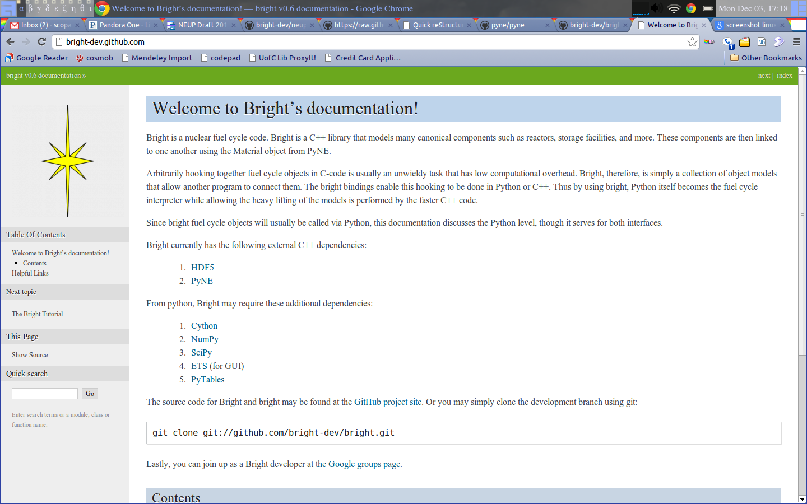

NEUP QA - Documentation
==============================

.. container:: main-title

    Providing Continuous Documentation

.. container:: main-names

    December 5th, 2012, Austin, TX

    Anthony Scopatz, et al.

    The FLASH Center

    The University of Chicago

    scopatz@flash.uchicago.edu

Outline
================
* This NEUP is for the development of an integrated suite of software tools.

.. break

* Start with an overview of documentation in a software development context.

.. break

* End with grant specific strategies.

Overview
=========
Code documentation is the probably most important task for a software developer.  

.. break

This is because it is "`the only way that 90% of people will ever interact
with you or your code`_".  In fact, it is the only mechanism that scales; there are 
only so many emails that you can write.  

.. break

Being able to write software and being able to write in 
your primary spoken language are different skills.  

.. break

No excuse for bad or missing documentation.

.. _the only way that 90% of people will ever interact with you or your code: http://blip.tv/pycon-us-videos-2009-2010-2011/pycon-2011-writing-great-documentation-4899042

The Many Stages of Documentation
=================================

* Readmes

* User Guides

* Developer Guides

* Self-Documenting Code

* Code Comments

* API Documentation

* Auto-Documentation

Readmes
==========
The omnipresent ``README`` file is typically a plain text file that sits next to
the code.  They typically may contain markup but are often quite terse.  The 
point of a readme file is to provide only the most basic of information to the 
user / developer::

            Linux kernel release 3.x <http://kernel.org/>

    These are the release notes for Linux version 3.  Read them carefully,
    as they tell you what this is all about, explain how to install the
    kernel, and what to do if something goes wrong. 

    WHAT IS LINUX?

    ...

User's Guides
=============
These often take the form of books or pdfs that aim to explain top level architecture 
and functionality to possibly novice users.  

.. break

Such documents are extremely helpful for bringing in new
members to the community, going in depth into the theory, and as a reference manual 
for advanced users and developers.  

.. break

The code must be stable for a comprehensive user's guide.

**Examples:** `FLASH`_, `NumPy`_.

.. _FLASH: http://flash.uchicago.edu/site/flashcode/user_support/flash4b_ug.pdf
.. _NumPy: http://www.tramy.us/numpybook.pdf

Developer Guides
================
Assume a basic mastery of the project.  

.. break

They are typically for people who want to *become*
developers on a project rather than for existing developers.  

.. break

Most important for code projects that have plugin architectures and where the
line between user and developer is less well defined.

**Examples:** `Android`_, `Python`_.

.. _Android: http://developer.android.com/guide/index.html
.. _Python: http://docs.python.org/devguide/

Self-Documenting Code
=====================
The `self-documenting code`_ claim is that it is often 
possible to write code such that new readers can understand what the
code does simply by reading it.  Therefore, no extra documentation is required.
It is all there in the code itself.

.. break

Obvious pitfalls, but some merits in terms having meaningful naming conventions,
structure, and overall readable software.  

.. break

However using this documentation strategy exclusively is *highly* inadvisable.

.. _self-documenting code: http://c2.com/cgi/wiki?SelfDocumentingCode

Code Comments
=============
Every language has a special character (or two) which indicate to the parser, 
compiler, or interpreter that whatever comes after or between these characters
should be ignored.  

.. break

Allows the author to annotate and explain the 
code that they are writing *right at the point that they are writing it!*  

.. break

Helpful if something weird, obtuse, or obscure is about to happen
and the author has a chance to explain themselves to future devs
(often themselves in 1, 2, 6 months).

Code Comments
=============
Literally *anything* in comments: publication citations, ASCII art, messages to lost 
loves, and warnings to other developers, etc.

.. break

In Python, the comment character is the hash symbol ``#``.  The following example
shows how you might help explain a toaster:

.. code-block:: python

    def toast(slices, toastiness, msg=None):
        # make sure the toaster has the right setting
        toastiness = int(toastiness) if 0 < toastiness else 5
        print "Engage the bread warming!"

Code Comments
=============
It is possible to over-document code with comments.  
Comments shouldn't simply repeat what the code is doing.

.. code-block:: python

    # init a to 0
    a = 0

    # make b 'a string'
    b = 'a string'

    # Add one to a
    a = a + 1

API Documentation
=================
The application programming interface (API) is the definition of the protocol that 
two pieces of code may use to interact with one another.  

.. break

Consider the case of 
functions.  All functions have a function signature which specifies how many 
arguments they accept and their return values.  

.. break

This signature along with the 
module name and function name is the API.  
(The function object/pointer itself 
is the implementation and is independent of the abstract API.)

API Documentation
=================
Just because you have an argument list, however, does not imply that the meaning
of the arguments is known.  For example:

.. code-block:: python

    def f(a, b=10):
        ...

We know that ``f()`` accepts two argument ``a`` and ``b`` and that ``b`` should 
probably be an integer.  But what does ``f()`` actually do?  What do these arguments 
mean in this context?

API Documentation
=================
Python allows the user to define API documentation right at the function, class, 
module, or variable definition.  

.. break

Every Python object may have an ``__doc__`` attribute which is a string 
representation of the API docs.   This is known as a *docstring*.  

.. break

Simple things should have simple docstrings.

.. break

Most Python docstrings are written in a markup language called 
`reStructuredText`_ (rST).

.. _reStructuredText: http://sphinx.pocoo.org/rest.html

API Documentation
=================
For example,

.. code-block:: python

    def mean(numlist):
        """Computes the mean of a list of numbers."""
        try:
            total = sum(numlist)
            length = len(numlist)
        except ValueError:
            print "The number list was not a list of numbers."
        except:
            print "There was a problem evaluating the number list."
        return total/length

Auto-Documentation
==================
Automatic documentation is the powerful concept that the comments and docstrings
that the developer has already written can be scraped from the code base and 
placed on a website or into a user's guide.  

.. break

This significantly reduces the overhead
of having to write and maintain may documents which contain effectively the same 
information. 

.. break

Popular auto-doc projects are `javadoc`_ for Java, 
`dOxygen`_ for most compiled languages, and `sphinx`_ for Python.

.. _javadoc: http://www.oracle.com/technetwork/java/javase/documentation/index-jsp-135444.html
.. _dOxygen: http://www.stack.nl/~dimitri/doxygen/
.. _sphinx: http://sphinx.pocoo.org/

Reproducibility
================================
* To satisfy the "Laboratory Notebook" requirement a version control system 
  will be used through out the duration of this project.

.. break

* Version control is the software engineering way a documenting and managing every 
  change that occurs in a code base over time.  

.. break

* The *de facto* standard in contemporary scientific computing is git with mirror
  repositories hosted publicly at `github.com <https://github.com>`_.

Replication
================
* To ensure replication, both the code and the documentation will be continuously 
  updated according to the methods just discussed.

.. break

* A public website for API documentation, Developer's Guide, and User's Guide will
  will developed and maintained with the aid of auto-documentation tools.

.. break

* A PDF of the user's guide will also be made available in addition to the web form.
  Peer-reviewed articles related to the methods will also be published.

Website Examples
===================

* Repository: `<https://github.com/bright-dev/bright>`_

* HTML Documentation: `<http://bright-dev.github.com/>`_

Take Away Points
=================
* A version control system (namely git) will be used to track changes to the 
  code base over time.  This will be updated regularly and will be publicly 
  available.

.. break

* Online documentation will be created, updated, and maintained.  This will 
  be available through github.com for the time being.  

.. break

* A comprehensive user's manual will be written and then updated at least as 
  frequently as the code release and grant schedule dictate.

Final Note & Questions
=======================
**Note:** *This strategy is effectively the same as the one pursued in other NEUP 
funded projects.*

.. break

.. container:: main-title

    Questions?
